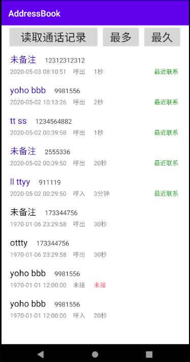

# Android-adderss-book
课设大作业  
### 功能：  
1.  获取本机所有通话信息，并分类显示：  
a)	所有拨出电话  
b)	所有已接电话  
c)	所有未接电话  
2.	统计所有通话信息  
a)	获取通话时长最长的记录  
b)	获取通话次数最多的电话号码  
c)	获取最近5个通话记录  

---------
**模拟机：Pixel 3a XL API 29*

#### 2020/5/3

1. 修改ListView展示方式，使用自定义Adapter实现布局；
   > 优化布局，对较新的记录增加颜色，突出显示。  

2. 修改按键为：读取记录、最多、最久
   > 读取记录：获得所有通话记录。  
   > 最多：获得最联系多次的联系人信息，并可拨打电话给他。  
   > 最久：获得通话时间最长的联系人信息，并可拨打电话给他。

   

#### 2020/5/2

1. 点击‘读取通话记录’按钮可以获得所有记录，按时间倒序展示；
   > 包含：备注名，电话号码，通话时间，通话时长，通话状态（呼入、呼出、未接）。  
   > 显示最近五条通话记录，多出来的放在‘较早些时候’下。
2. 调用 `addContent` 方法增加测试用例；
3. 增加‘最爱’按钮；

